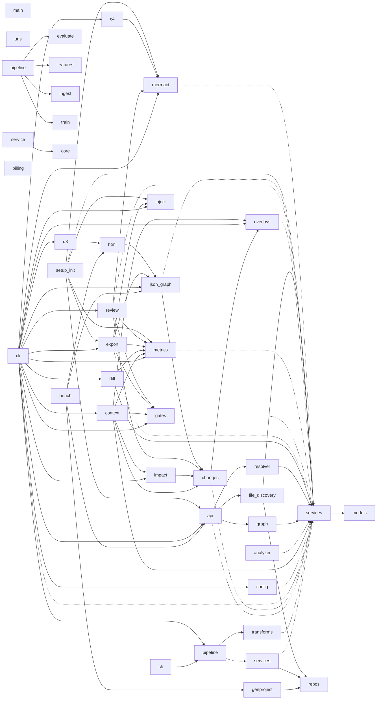

# 🗺️ py-code-visualizer

[](https://pypi.org/project/py-code-visualizer/)
[](https://pypi.org/project/py-code-visualizer/)
[](https://github.com/haider1998/PyVisualizer/actions/workflows/ci.yml)
[](https://www.python.org/downloads/)
[](https://opensource.org/licenses/MIT)
[](#architecture)

> **Deterministic, AST-verified architecture ground truth for Python.**
> LLMs guess your architecture. **py-code-visualizer proves it** — every edge is
> traceable to a `file:line`.

<p align="center">
  
</p>

<p align="center">
  <b><a href="https://haider1998.github.io/pyvisualizer/playground.html">⚡ Try it live in your browser →</a></b>
  &nbsp;·&nbsp; drop a <code>.py</code> file, see the graph, nothing uploaded
</p>

py-code-visualizer reads your Python source with static analysis (no code is ever
imported or executed) and produces a call graph you can trust: self-healing
README diagrams, PR architecture-change reports, CI gates that block circular
dependencies, and a fully offline interactive map. Because the output is
**deterministic**, it lives in your pipelines and never drifts.

```bash
pip install py-code-visualizer && py-code-visualizer visualize .
```

**Who is this for?** Any Python developer, whatever your stack:
[**Django**](https://haider1998.github.io/pyvisualizer/for/django.html) (real
request flow, not just the model schema) ·
[**FastAPI**](https://haider1998.github.io/pyvisualizer/for/fastapi.html) (every
route's blast radius, async + decorators) ·
[**ML pipelines**](https://haider1998.github.io/pyvisualizer/for/ml-pipelines.html)
(map the pipeline, find dead experiments). See the
[honest comparison](https://haider1998.github.io/pyvisualizer/compare.html) and
[measured facts](https://haider1998.github.io/pyvisualizer/facts.html).

---

## Why this exists (and why an LLM can't do it)

An LLM asked to diagram your repo produces the architecture it *expects* a repo
like yours to have — plausible, confident, and subtly wrong. It invents links
between modules that never call each other, silently drops what didn't fit the
context window, and gives a different answer every run, so you can never diff it
or put it in CI.

PyVisualizer is the opposite by construction:

| | LLM diagram | PyVisualizer |
|---|---|---|
| **Correctness** | Inferred, often hallucinated | Parsed from the AST |
| **Provenance** | None | Every edge → `file:line` |
| **Determinism** | Different every run | Byte-identical |
| **Ambiguity** | Hidden behind confidence | Flagged, with candidates kept |
| **CI-able** | No | Yes — gates, diffs, drift checks |
| **Code leaves the machine** | Usually | Never |

When a call genuinely can't be resolved to one target, we **don't pick one and
pretend** — we tag the edge `ambiguous` and keep the full candidate list. That
honesty is the whole product.

---

## Install

```bash
pip install py-code-visualizer
```

## 60-second start

```bash
# Interactive, fully self-contained HTML map (opens offline, zero network)
py-code-visualizer visualize ./your_project -o architecture.html

# Keep a live diagram inside your README forever
py-code-visualizer readme ./your_project

# Fail CI on new circular dependencies
py-code-visualizer check ./your_project --fail-on-cycles

# What breaks if I touch this function?
py-code-visualizer impact your_pkg.core.save ./your_project
```

---

## For a scrappy startup 🚀

You will never schedule a "docs sprint." So don't. Add one line to CI and your
README always carries a current architecture diagram — investor- and
due-diligence-ready for free — while every PR gets a comment showing exactly
what changed structurally.

```yaml
# .github/workflows/architecture.yml
- uses: haider1998/PyVisualizer@v2
  with: { mode: readme }
```

A new contractor onboards from the interactive map instead of a three-day Slack
Q&A. Pivots stop being archaeology.

## For a Fortune 500 enterprise 🏛️

- **Code never leaves the machine.** Pure AST, no execution, no API calls — the
  anti-LLM tool for security review. Generated HTML is a single file with zero
  network requests (air-gap safe).
- **Architecture-as-code gates.** Declare layers and forbidden dependencies;
  the build fails on violations — at the *call-graph* level, stricter than
  import linters.
- **Audit trail.** Deterministic diagrams committed by CI make git history your
  dated, attributable architecture change-log (SOC 2 / review boards).
- **Monorepo scale.** Hierarchical rollup (module → class → function), never
  silent sampling.

```toml
# pyproject.toml
[tool.pyvisualizer.rules]
layers = ["api", "domain", "infra"]
forbid = ["domain -> api", "domain -> infra"]
```

---

## Commands

| Command | What it does |
|---|---|
| `review <path> --base <ref>` | **PR review report**: changed functions, blast radius, risk flags, focused subgraph — clickable `file:line` on every reference |
| `context <path> --focus <fn>` | **Verified context pack for AI agents**: task-scoped, budget-bounded, zero guessed edges |
| `context <path> --task "<prose>"` | Same pack, seeded from a **natural-language task description** (named symbols first, lexical matches as labeled hints; `--strategy graph\|text\|hybrid`) |
| `visualize` | Render `html` · `mermaid` · `json` · `c4` · `svg`/`png` |
| `readme` | Inject/update a Mermaid diagram in any Markdown file (idempotent) + jump-to-source index |
| `json` | Emit the canonical, diffable graph JSON |
| `diff base.json head.json` | PR-ready architecture-change report (+ new-cycle gate) |
| `check` | Enforce layering rules & cycles — CI gate (`--dead-code` too) |
| `impact <fn>` | Blast-radius: transitive callers/callees + risk line (`--format markdown`) |
| `health` | Architecture health score (A–F) with an SVG badge |
| `export` | `ARCHITECTURE.json` + `ARCHITECTURE.md` + AGENTS.md wiring (`--check` freshness gate) |
| `init` | Opt-in setup — generate only the automation you choose (`review`/`readme`/`context`/`gates`) |

**Two jobs, one engine.** *review* makes code review on a large repo a focused
few-minute pass; *context* gives an AI agent a verified, ~96%-smaller slice of the
architecture instead of the whole repo. See [`VISION.md`](VISION.md) and the
[use-case walkthroughs](https://haider1998.github.io/pyvisualizer/use-cases/).

### MCP server (agents pull, mid-task)

The same engine is available as an [MCP](https://modelcontextprotocol.io) server,
so Claude Code / Cursor / any MCP client can query the verified graph exactly when
a task needs it instead of receiving a guessed pack up front:

```bash
pip install 'py-code-visualizer[mcp]'   # Python 3.10+
pyvisualizer-mcp /path/to/project
```

Three tools, deliberately few: `search_code` (lexical search over every
function's name and source), `context_pack` (the budget-bounded verified pack,
seeded by task and/or focus), and `impact` (blast radius before you change a
function). The server watches file mtimes and rebuilds its in-memory graph only
when the project actually changes.

## Use cases (real commands, real output)

Three end-to-end walkthroughs, each backed by a runnable fixture in
[`examples/scenarios/`](examples/scenarios) — every command and every line of
output is reproducible, nothing is staged:

- 🗺️ **[The orphan monolith](https://haider1998.github.io/pyvisualizer/use-cases/orphan-monolith.html)** —
  onboard onto an undocumented codebase with `visualize` + `health` + `check --dead-code`.
- 🛡️ **[The audit deadline](https://haider1998.github.io/pyvisualizer/use-cases/soc2-audit.html)** —
  enforce layering rules at the call-graph level and produce dated SOC 2 evidence.
- 🧨 **[The fearless refactor](https://haider1998.github.io/pyvisualizer/use-cases/fearless-refactor.html)** —
  `impact` blast radius, then a `diff` gate that fails a PR on a new cycle.

See the [full use-case index + a recipe for every command](https://haider1998.github.io/pyvisualizer/use-cases/).

**Measured** (reproduce with `python benchmarks/bench.py` → [`docs/benchmarks.json`](docs/benchmarks.json)):
a **98,669-line** project maps to a full call graph in **~4.9 s** (26,658 functions),
**100%** of edges carry `file:line`, output is **byte-identical** across runs, and the
generated HTML makes **0** network requests. *(macOS arm64, Python 3.14; speed is
hardware-dependent — provenance, determinism, and zero-network are structural.)*

## The interactive map

A single self-contained HTML file (no CDN, works offline):

- **Layered abstraction** — toggle module → class → function views
- **Click any node** — signature, `file:line`, callers & callees (all clickable)
- **⌘K command palette**, live search, module filter
- **Deep links** — the URL encodes the selected node; paste it in Slack and your
  teammate lands on the exact function
- **Tour mode** — auto-generated walkthrough from detected entry points
- **Overlays** — cycles (red), ambiguity (dashed), and `--churn` git-heatmap
- Minimap, pan/zoom/drag, light/dark, SVG export

## Feed the graph to your AI tools

```bash
py-code-visualizer export --for-ai ./your_project
```

Point Cursor / Claude at the verified `ARCHITECTURE.json` instead of asking a
model to re-derive structure from raw source. **Point your agent at the graph,
not the repo.**

---

## Accuracy guarantees

- Nested classes, methods, and closures are collected with correct qualified
  names (`pkg.Outer.Inner.method`, `mod.func.<locals>.inner`).
- Chained calls (`get_client().fetch()`), comprehensions, and lambdas are
  captured.
- `super()`/inherited calls resolved through the computed MRO (tagged
  `inherited`).
- Parameter and variable type annotations drive method resolution.
- Calls to stdlib/third-party code produce **no edge** — we never invent one.
- Ambiguous calls are tagged and kept as candidates; `--strict` drops them.

See [`docs/integrations.md`](docs/integrations.md) for GitHub Actions, GitLab
CI, and pre-commit setup.

## Configuration

```toml
[tool.pyvisualizer]
exclude = ["tests", "migrations"]
max_nodes = 120
target = "README.md"
detail = "module"          # module | class | function
```

## Roadmap

- ⏳ **Time-travel** — scrub your architecture's evolution across releases
- 🔁 **Watch mode** — live-reloading map while you refactor
- ✅ ~~**MCP server**~~ — shipped: `pyvisualizer-mcp` (`search_code`, `context_pack`, `impact`)

## Architecture

The diagram below is generated by PyVisualizer itself and kept in sync by CI.

<!-- pyvisualizer:start -->
<!-- This diagram is auto-generated by py-code-visualizer. Do not edit by hand; run `py-code-visualizer readme` to refresh. -->

*120 functions · 199 calls · health D (66/100) — detail: module*



<sub>🔒 Deterministic, AST-verified — no code executed. Generated by [py-code-visualizer](https://github.com/haider1998/PyVisualizer).</sub>

<details>
<summary>📍 Jump to source (120 functions)</summary>

- [`benchmarks.bench._bench_target`](benchmarks/bench.py#L177)
- [`benchmarks.bench._determinism_proof`](benchmarks/bench.py#L113)
- [`benchmarks.bench._html_network_proof`](benchmarks/bench.py#L132)
- [`benchmarks.bench.run`](benchmarks/bench.py#L221)
- [`benchmarks.genproject._gen_module`](benchmarks/genproject.py#L41)
- [`benchmarks.genproject.generate`](benchmarks/genproject.py#L135)
- [`examples.sample_project.main.main`](examples/sample_project/main.py#L7)
- [`examples.scenarios.django_shop.models.Cart.for_user`](examples/scenarios/django_shop/models.py#L12)
- [`examples.scenarios.django_shop.services.CartService.add`](examples/scenarios/django_shop/services.py#L11)
- [`examples.scenarios.django_shop.services.OrderService.checkout`](examples/scenarios/django_shop/services.py#L22)
- [`examples.scenarios.django_shop.services.OrderService.get`](examples/scenarios/django_shop/services.py#L29)
- [`examples.scenarios.django_shop.urls.dispatch`](examples/scenarios/django_shop/urls.py#L7)
- [`examples.scenarios.fastapi_svc.repos.OrderRepo.insert`](examples/scenarios/fastapi_svc/repos.py#L8)
- [`examples.scenarios.fastapi_svc.services.OrderFlow.fetch`](examples/scenarios/fastapi_svc/services.py#L22)
- [`examples.scenarios.fastapi_svc.services.OrderFlow.place`](examples/scenarios/fastapi_svc/services.py#L16)
- [`examples.scenarios.ml_pipeline.evaluate.evaluate_model`](examples/scenarios/ml_pipeline/evaluate.py#L4)
- [`examples.scenarios.ml_pipeline.features.build_features`](examples/scenarios/ml_pipeline/features.py#L4)
- [`examples.scenarios.ml_pipeline.ingest.load_dataset`](examples/scenarios/ml_pipeline/ingest.py#L4)
- [`examples.scenarios.ml_pipeline.pipeline.run`](examples/scenarios/ml_pipeline/pipeline.py#L9)
- [`examples.scenarios.ml_pipeline.train.train_model`](examples/scenarios/ml_pipeline/train.py#L4)
- [`examples.scenarios.orphan_monolith.app.cli.run`](examples/scenarios/orphan_monolith/app/cli.py#L7)
- [`examples.scenarios.orphan_monolith.app.pipeline.ReportPipeline.build`](examples/scenarios/orphan_monolith/app/pipeline.py#L11)
- [`examples.scenarios.orphan_monolith.app.pipeline.ReportPipeline.render`](examples/scenarios/orphan_monolith/app/pipeline.py#L16)
- [`examples.scenarios.orphan_monolith.app.transforms.summarize`](examples/scenarios/orphan_monolith/app/transforms.py#L11)
- [`examples.scenarios.refactor.after.core.persist`](examples/scenarios/refactor/after/core.py#L7)
- [`examples.scenarios.refactor.after.service.cancel_order`](examples/scenarios/refactor/after/service.py#L11)
- [`examples.scenarios.refactor.after.service.place_order`](examples/scenarios/refactor/after/service.py#L7)
- [`examples.scenarios.soc2_audit.domain.billing.BillingService.charge`](examples/scenarios/soc2_audit/domain/billing.py#L12)
- [`pyvisualizer.api.build_graph`](pyvisualizer/api.py#L47)
- [`pyvisualizer.changes.Linker.ref`](pyvisualizer/changes.py#L202)
- [`pyvisualizer.changes.changed_lines_from_git`](pyvisualizer/changes.py#L62)
- [`pyvisualizer.changes.map_lines_to_functions`](pyvisualizer/changes.py#L121)
- [`pyvisualizer.changes.repo_web_url`](pyvisualizer/changes.py#L149)
- [`pyvisualizer.changes.resolve_base_ref`](pyvisualizer/changes.py#L46)
- [`pyvisualizer.cli._build`](pyvisualizer/cli.py#L269)
- [`pyvisualizer.cli._render_graphviz`](pyvisualizer/cli.py#L354)
- [`pyvisualizer.cli.cmd_check`](pyvisualizer/cli.py#L574)
- [`pyvisualizer.cli.cmd_context`](pyvisualizer/cli.py#L692)
- [`pyvisualizer.cli.cmd_diff`](pyvisualizer/cli.py#L536)
- [`pyvisualizer.cli.cmd_export`](pyvisualizer/cli.py#L633)
- [`pyvisualizer.cli.cmd_health`](pyvisualizer/cli.py#L609)
- [`pyvisualizer.cli.cmd_impact`](pyvisualizer/cli.py#L655)
- [`pyvisualizer.cli.cmd_readme`](pyvisualizer/cli.py#L444)
- [`pyvisualizer.cli.cmd_review`](pyvisualizer/cli.py#L667)
- [`pyvisualizer.cli.cmd_visualize`](pyvisualizer/cli.py#L288)
- [`pyvisualizer.cli.main`](pyvisualizer/cli.py#L250)
- [`pyvisualizer.config.load_config`](pyvisualizer/config.py#L102)
- [`pyvisualizer.context._node_line`](pyvisualizer/context.py#L90)
- [`pyvisualizer.context._resolve_focus`](pyvisualizer/context.py#L63)
- [`pyvisualizer.context._select_nodes`](pyvisualizer/context.py#L119)
- [`pyvisualizer.context.build_context_pack`](pyvisualizer/context.py#L168)
- [`pyvisualizer.core.analyzer.DefinitionCollector._visit_function`](pyvisualizer/core/analyzer.py#L360)
- [`pyvisualizer.core.analyzer.DefinitionCollector.visit_ClassDef`](pyvisualizer/core/analyzer.py#L327)
- [`pyvisualizer.core.analyzer.ModuleAnalyzer._decorator_names`](pyvisualizer/core/analyzer.py#L158)
- [`pyvisualizer.core.analyzer.ModuleAnalyzer._extract_attribute_chain`](pyvisualizer/core/analyzer.py#L189)
- [`pyvisualizer.core.analyzer.ModuleAnalyzer._process_annotation`](pyvisualizer/core/analyzer.py#L259)
- [`pyvisualizer.core.analyzer.ModuleAnalyzer._process_decorator`](pyvisualizer/core/analyzer.py#L206)
- [`pyvisualizer.core.graph.FunctionCallVisitor._extract_attribute_chain`](pyvisualizer/core/graph.py#L421)
- [`pyvisualizer.core.graph.FunctionCallVisitor._extract_call_target`](pyvisualizer/core/graph.py#L407)
- [`pyvisualizer.core.graph.FunctionCallVisitor._find_method_in_hierarchy`](pyvisualizer/core/graph.py#L329)
- [`pyvisualizer.core.graph.FunctionCallVisitor._resolve_call`](pyvisualizer/core/graph.py#L201)
- [`pyvisualizer.core.graph.FunctionCallVisitor._resolve_class_name`](pyvisualizer/core/graph.py#L366)
- [`pyvisualizer.core.graph.FunctionCallVisitor._seed_param_types`](pyvisualizer/core/graph.py#L121)
- [`pyvisualizer.core.graph.FunctionCallVisitor._visit_function_common`](pyvisualizer/core/graph.py#L96)
- [`pyvisualizer.core.graph.FunctionCallVisitor.visit_AnnAssign`](pyvisualizer/core/graph.py#L163)
- [`pyvisualizer.core.graph.build_call_graph`](pyvisualizer/core/graph.py#L475)
- [`pyvisualizer.core.resolver.filter_by_depth`](pyvisualizer/core/resolver.py#L25)
- [`pyvisualizer.diff._cycle_keys`](pyvisualizer/diff.py#L30)
- [`pyvisualizer.diff._graph_from_json`](pyvisualizer/diff.py#L21)
- [`pyvisualizer.diff._short`](pyvisualizer/diff.py#L127)
- [`pyvisualizer.diff.diff_graphs`](pyvisualizer/diff.py#L84)
- [`pyvisualizer.diff.render_change_mermaid`](pyvisualizer/diff.py#L131)
- [`pyvisualizer.diff.render_markdown`](pyvisualizer/diff.py#L170)
- [`pyvisualizer.export._agents_md_plan`](pyvisualizer/export.py#L147)
- [`pyvisualizer.export._entry_points`](pyvisualizer/export.py#L24)
- [`pyvisualizer.export._json_content`](pyvisualizer/export.py#L113)
- [`pyvisualizer.export.build_ai_markdown`](pyvisualizer/export.py#L32)
- [`pyvisualizer.export.export_for_ai`](pyvisualizer/export.py#L166)
- [`pyvisualizer.export.export_would_change`](pyvisualizer/export.py#L192)
- [`pyvisualizer.gates.check_layer_rules`](pyvisualizer/gates.py#L53)
- [`pyvisualizer.gates.cycle_violations`](pyvisualizer/gates.py#L106)
- [`pyvisualizer.gates.find_cycles`](pyvisualizer/gates.py#L83)
- [`pyvisualizer.impact.analyze_impact`](pyvisualizer/impact.py#L46)
- [`pyvisualizer.impact.render_markdown`](pyvisualizer/impact.py#L96)
- [`pyvisualizer.impact.resolve_target`](pyvisualizer/impact.py#L32)
- [`pyvisualizer.impact.risk_line`](pyvisualizer/impact.py#L68)
- [`pyvisualizer.inject.inject`](pyvisualizer/inject.py#L84)
- [`pyvisualizer.inject.inject_block`](pyvisualizer/inject.py#L51)
- [`pyvisualizer.inject.update_file`](pyvisualizer/inject.py#L102)
- [`pyvisualizer.metrics._is_entry_point`](pyvisualizer/metrics.py#L75)
- [`pyvisualizer.metrics.badge_svg`](pyvisualizer/metrics.py#L209)
- [`pyvisualizer.metrics.compute_health`](pyvisualizer/metrics.py#L88)
- [`pyvisualizer.metrics.find_dead_code`](pyvisualizer/metrics.py#L153)
- [`pyvisualizer.overlays._git`](pyvisualizer/overlays.py#L23)
- [`pyvisualizer.overlays._toplevel`](pyvisualizer/overlays.py#L33)
- [`pyvisualizer.overlays.apply_churn`](pyvisualizer/overlays.py#L67)
- [`pyvisualizer.overlays.git_churn`](pyvisualizer/overlays.py#L41)
- [`pyvisualizer.review._risk_lines`](pyvisualizer/review.py#L183)
- [`pyvisualizer.review.analyze_review`](pyvisualizer/review.py#L50)
- [`pyvisualizer.review.render_markdown`](pyvisualizer/review.py#L112)
- [`pyvisualizer.review.render_text`](pyvisualizer/review.py#L198)
- [`pyvisualizer.serializers.c4.generate_c4_dsl`](pyvisualizer/serializers/c4.py#L27)
- [`pyvisualizer.serializers.json_graph._detect_repo_url`](pyvisualizer/serializers/json_graph.py#L151)
- [`pyvisualizer.serializers.json_graph._node_kind`](pyvisualizer/serializers/json_graph.py#L44)
- [`pyvisualizer.serializers.json_graph.graph_to_dict`](pyvisualizer/serializers/json_graph.py#L65)
- [`pyvisualizer.serializers.json_graph.graph_to_json`](pyvisualizer/serializers/json_graph.py#L162)
- [`pyvisualizer.setup_init._action_context`](pyvisualizer/setup_init.py#L255)
- [`pyvisualizer.setup_init._action_readme`](pyvisualizer/setup_init.py#L232)
- [`pyvisualizer.setup_init._plan_files`](pyvisualizer/setup_init.py#L176)
- [`pyvisualizer.setup_init._record_features`](pyvisualizer/setup_init.py#L205)
- [`pyvisualizer.setup_init.run_init`](pyvisualizer/setup_init.py#L305)
- [`pyvisualizer.utils.file_discovery.analyze_project`](pyvisualizer/utils/file_discovery.py#L151)
- [`pyvisualizer.utils.file_discovery.get_module_name`](pyvisualizer/utils/file_discovery.py#L96)
- [`pyvisualizer.visualizers.d3.generate_d3_visualization`](pyvisualizer/visualizers/d3.py#L18)
- [`pyvisualizer.visualizers.html.generate_html_visualization`](pyvisualizer/visualizers/html.py#L29)
- [`pyvisualizer.visualizers.mermaid._categorize_methods`](pyvisualizer/visualizers/mermaid.py#L301)
- [`pyvisualizer.visualizers.mermaid._rollup`](pyvisualizer/visualizers/mermaid.py#L39)
- [`pyvisualizer.visualizers.mermaid.create_interactive_html`](pyvisualizer/visualizers/mermaid.py#L336)
- [`pyvisualizer.visualizers.mermaid.generate_github_mermaid`](pyvisualizer/visualizers/mermaid.py#L82)
- [`pyvisualizer.visualizers.mermaid.generate_styled_mermaid`](pyvisualizer/visualizers/mermaid.py#L114)
</details>
<!-- pyvisualizer:end -->

## Contributing

See [CONTRIBUTING.md](CONTRIBUTING.md). PyVisualizer is MIT-licensed.
